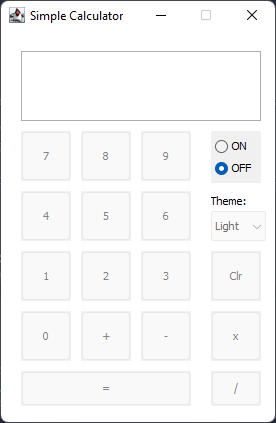
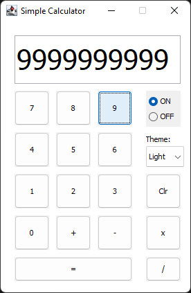
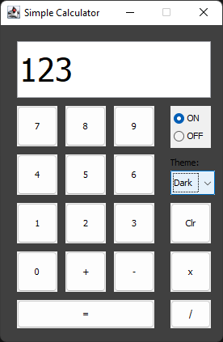

# Project Title
## Simple Calculator

 

 
 

### Developed by:

* Ihsan Dzahri
* Ahmad Izzudin
* Ahmad Naim Shafiq
* Danish Luqman

## Description

This Java program is used to solve simple arithmetic problems

## Getting Started

### Dependencies

* Java Swing 
* Java AWT

### Installing

* Make sure your system is running openjdk version "15.0.2" 

### Executing program

* Unzip the folder and run the Calculator.jar

## Authors

Contributors names and contact info

<table>
<tr><td>Ihsan Dzahri</td><td><a href="https://github.com/hisunn">@hisunn</a></td></tr>
<tr><td>Ahmad Izzudin</td><td><a href="https://github.com/aiddin">@aiddin</a></td></tr>
<tr><td>Ahmad Naim Shafiq</td><td><a href="https://github.com/NaimShafiq">@NaimShafiq</a></td></tr>
<tr><td>Danish Luqman</td><td><a href="https://github.com/nishji226">@nishji226</a></td></tr>
</table>
